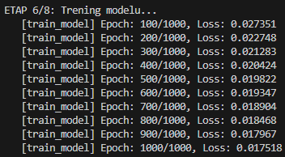
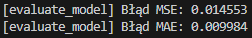
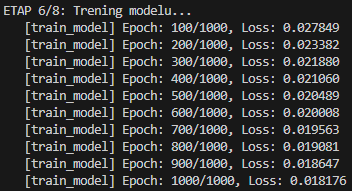
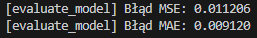
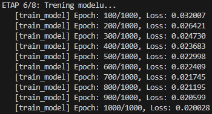
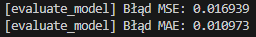

# fx-analyzer

**PL:** Narzędzie do analizy rynku FX

**EN:** FX market analysis tool

## Zastrzeżenie (Disclaimer)
**PL:** Oprogramowanie służy wyłącznie do celów edukacyjnych i badawczych. Treści generowane przez program oraz kod źródłowy nie stanowią porady inwestycyjnej ani rekomendacji zakupu lub sprzedaży jakichkolwiek instrumentów finansowych. Handel na rynku Forex wiąże się ze znacznym ryzykiem utraty kapitału. Autor nie ponosi żadnej odpowiedzialności za decyzje inwestycyjne oraz ewentualne straty finansowe poniesione w wyniku korzystania z tego narzędzia.

**EN:** This software is for educational and research purposes only. The content generated by the program and the source code do not constitute investment advice or a recommendation to buy or sell any financial instruments. Forex trading involves significant risk of loss of capital. The author bears no responsibility for investment decisions or financial losses incurred as a result of using this tool.

## Opis projektu
Projekt ma na celu stworzenie narzędzia do analizy kursów par walutowych na rynku Forex, a dokładniej do wykrywania krótko- i średnioterminowych trendów oraz testowania i implementowania strategii autotradingu opartych na linii trendu. 

Zamiast ręcznie określać, który ze wskaźników najlepiej odwzorowuje trend i w jakim stopniu, wykorzystano do tego celu model sieci neuronowej. Jako wejść modelu świadomie użyto wskaźników o dużej inercji (prostych średnich kroczących z dziennych cen zamknięcia), aby model nie uczył się surowych cen, lecz skupił się na odwzorowaniu trendu danego instrumentu. Otrzymaną w ten sposób predykcją posłużono się do generowania sygnałów kupna i sprzedaży. Stworzono także moduł symulacji do oceny wygenerowanych sygnałów.

## Struktura projektu
* `src/` - katalog źródłowy z modułami programu
* `src/ingestion.py` - moduł odpowiadający za pobranie i przygotowanie danych
* `src/features.py` - moduł odpowiadający za dodanie cech oraz normalizację danych
* `src/model.py` - moduł odpowiadający za przygotowanie tensorów, parametrów modelu, trening i ewaluację
* `src/strategy.py` - moduł odpowiadający za obliczenia wskaźników, symulację strategii, obliczenia transakcji oraz wizualizację
* `src/utils.py` - funkcje pomocnicze
* `main.py` - główny punkt wejścia aplikacji
* `Pipfile` & `Pipfile.lock` - konfiguracja środowiska (Pipenv)

## Instalacja i użycie
1. Sklonuj repozytorium:
   ```bash
   git clone [https://github.com/vec-law/fx-analyzer.git](https://github.com/vec-law/fx-analyzer.git)
   cd fx-analyzer
   ```
2. Zainstaluj biblioteki używając Pipenv:
   ```bash
   pipenv install
   ```
3. Uruchom program w środowisku wirtualnym:
   ```bash
   pipenv run python main.py
   ```
## Ładowanie danych
Program posiada zaimplementowane automatyczne ładowanie danych z dwóch źródeł:
* **Plik CSV:** Program w pierwszej kolejności wyszukuje plik o nazwie `instrument_interval.csv` w katalogu `/data/raw`. Pliki CSV pozwalają na analizę dowolnych instrumentów. Należy jednak upewnić się, że dane te mają następującą strukturę: `['date', 'time', 'open', 'high', 'low', 'close', 'vol']`. Strukturę tę można dostosować bezpośrednio w module `ingestion.py`.
* **Biblioteka yfinance:** W przypadku braku pliku CSV, program automatycznie próbuje pobrać dane za pomocą modułu `yfinance`. Obecna wersja programu pozwala na pobieranie z `yfinance` tylko kursów par walutowych.

## Korekta danych
Program automatycznie sprawdza ciągłość załadowanych danych. W przypadku wykrycia luk, zbiór danych jest automatycznie przycinany do **najdłuższego spójnego zakresu**, co zapewnia poprawność wyliczania cech (średnich SMA).

## Interwały czasowe
W obecnej wersji programu zaimplementowano dzienne interwały czasowe. Należy pamiętać, aby interwał zapisywać w postaci `1d`.

## Dane wejściowe (Cechy)
Wejściem modelu jest **31 prostych średnich kroczących (SMA)** w zakresie od SMA10 do SMA40 z historycznych cen zamknięcia.

## Wartości docelowe
Wartościami docelowymi (target) są **ceny zamknięcia (close)**.

## Architektura modelu
Zastosowano Wielowarstwowy Perceptron (MLP) o płytkiej strukturze z dwiema warstwami ukrytymi:
* **Konfiguracja warstw:** 31 (wejście) -> 16 -> 8 -> 1 (wyjście)
* **Kształt:** Architektura lejka (redukcyjna)

## Parametry wejściowe
W obecnej wersji programu nie ma możliwości ustawiania parametrów za pomocą interfejsu użytkownika. Należy je zdefiniować bezpośrednio w pliku `main.py`.

Do parametrów wejściowych należą:
* `instrument` – nazwa instrumentu
* `interval` – interwał czasowy
* `target_column` – wybór kolumny z ceną docelową
* `strategy` – numer strategii
* `indicators` – wskaźniki, na podstawie których obliczane są cechy wejściowe
* `max_ind_period` – maksymalny okres średniej kroczącej
* `samples_limit` – limit długości zbioru danych
* `train_ratio` – współczynnik podziału na dane treningowe
* `seed` – parametr okreslający losowość danych
* `epochs` – liczba kroków (epok) pętli treningowej

## Komunikaty wyjściowe
Komunikaty wyjściowe są wyświetlane w konsoli systemowej i podzielone na 8 etapów. W każdym z nich funkcja wykonująca operację wyświetla komunikat w postaci: `[nazwa_funkcji] komunikat`. 

Rozpoczęcie każdego etapu sygnalizowane jest komunikatem `ETAP x/8 Nazwa etapu`, a zakończenie potwierdzane statusem `OK`. Jeżeli w trakcie trwania etapu wystąpi błąd, wyświetlana jest informacja `Przerwano`.

## Trening i ewaluacja
Trening i ewaluację modelu przeprowadzono przyjmując następujące parametry:
* **Instrument:** `EURUSD`
* **Interwał:** `1d` (dzienny)
* **Wartość docelowa (target):** `close` (cena zamknięcia)
* **Długość zbioru danych:** `4000`
* **Liczba epok:** `1000`
* **Źródło danych:** `yfinance`
* **Data wykonania:** `2026-01-03`

### Wyniki
Poniżej przedstawiono zrzuty ekranu z wynikami treningu i ewaluacji dla trzech różnych wielkości zbioru testowego:

#### Zbiór testowy: 250 (`train_ratio` = 0.9375)

| Trening | Ewaluacja |
| --- | --- |
|  |  |

#### Zbiór testowy: 500 (`train_ratio` = 0.875)

| Trening | Ewaluacja |
| --- | --- |
|  |  |

#### Zbiór testowy: 1000 (`train_ratio` = 0.75)

| Trening | Ewaluacja |
| --- | --- |
|  |  |

## Testowanie
Aby uruchomić testy integracyjne, upewnij się, że masz zainstalowany pakiet `pytest`, a następnie wykonaj:

```bash
pytest tests/test_integration.py
```
## Licencja (License)
**PL:** Ten projekt jest udostępniany na licencji **GNU General Public License v3.0**. Szczegóły znajdują się w pliku [LICENSE](LICENSE).

**EN:** This project is licensed under the **GNU General Public License v3.0**. See the [LICENSE](LICENSE) file for details.
